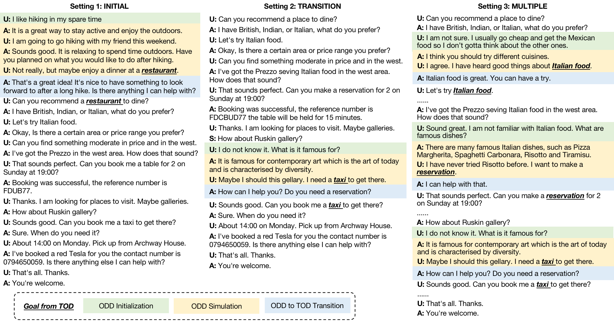

# MultiWOZChat

The dataset is constructed based on MultiWOZ 2.1 dataset. In this dataset, we use the proposed framework to automatically enrich TODs in three different settings.

  
   
    Illustration of three simulation settings. Given a TOD between a user (U) and a system agent (A), we consider three settings to synthesize ODD(s) to the TOD.

<!--  -->

## Data Format
Each record contains the following features:
- **Context** - The dialog context, including history and the current user turn.
- **Response** - The system response.
- **Knowledge** - It can be database results, retrieval results returned by BlenderBot 2, or empty (which means no extra knowledge is needed).
- **Selected_knowledge** - The selected knowledge for response generation.
- **Id** - The record id.
- **Task** - TOD or Chitchat.
- **Query** - The query for knowledge acquisition. It can be belief states or search queries.
